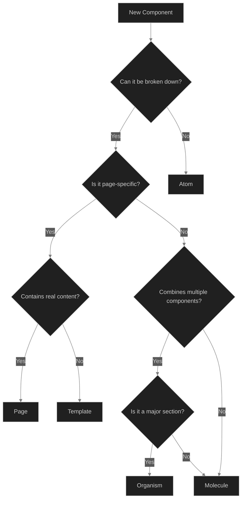

# Atomic Design Decision Flow

## Component Classification Table

| Level         | Characteristics                                                                                                                         | Examples                                                                                  | Decision Criteria                                                                                                    | When to Use                                                                                                                              |
| ------------- | --------------------------------------------------------------------------------------------------------------------------------------- | ----------------------------------------------------------------------------------------- | -------------------------------------------------------------------------------------------------------------------- | ---------------------------------------------------------------------------------------------------------------------------------------- |
| **Atoms**     | - Single, indivisible UI element - No dependencies on other components - Serves a single purpose - Can have variants/states | - Buttons - Input fields - Labels - Icons - Badges                        | - Can it be broken down further? - Does it rely on other components? - Does it have a single responsibility? | - When you need a basic UI element - When the component is self-contained - When it's frequently reused                          |
| **Molecules** | - Combination of atoms - Has a single functionality - Reusable across different contexts                                        | - Form fields (label + input) - Search bar - Button groups - Navigation items | - Does it combine multiple atoms? - Does it have a specific function? - Is it still relatively simple?       | - When atoms need to work together - When you need a reusable compound component - When functionality requires multiple elements |
| **Organisms** | - Complex UI sections - Contains molecules and/or atoms - Represents a distinct section - Context-specific                  | - Header - Footer - Form - Product card - Navigation menu                 | - Is it a major UI section? - Does it combine multiple molecules? - Is it context-dependent?                 | - When building major UI sections - When components need to work as a cohesive unit - When functionality is complex              |
| **Templates** | - Page-level layouts - No specific content - Focus on content structure - Contains multiple organisms                       | - Blog post layout - Product page layout - Dashboard layout                       | - Is it a page layout? - Does it define content areas? - Is it content-agnostic?                             | - When defining page structures - When creating reusable layouts - When establishing content patterns                            |
| **Pages**     | - Specific instances of templates - Contains actual content - Final, user-facing views                                          | - Home page - Contact page - Product detail page                                  | - Is it a specific implementation? - Does it contain real content? - Is it the final UI?                     | - When implementing specific views - When adding real content - When creating final pages                                        |

## Decision Flow Chart

## Quick Decision Guide

Ask these questions in sequence:

1. **Is it indivisible?**

   - Yes → Likely an **Atom**
   - No → Continue to next question

2. **Does it combine only Atoms?**

   - Yes → Likely a **Molecule**
   - No → Continue to next question

3. **Is it a distinct section of the interface?**

   - Yes → Likely an **Organism**
   - No → Continue to next question

4. **Is it a page layout without specific content?**

   - Yes → Likely a **Template**
   - No → Continue to next question

5. **Does it represent a specific page with real content?**
   - Yes → It's a **Page**
   - No → Revisit previous questions

## Examples with Reasoning

### Atom Examples

- **Button**
  - ✓ Cannot be broken down further
  - ✓ Single responsibility
  - ✓ No dependencies on other components
  - ✓ Highly reusable

### Molecule Examples

- **Search Bar**
  - ✓ Combines input and button atoms
  - ✓ Single functionality
  - ✓ Reusable in different contexts
  - ✓ Clear relationship between components

### Organism Examples

- **Navigation Menu**
  - ✓ Complex functionality
  - ✓ Contains multiple molecules
  - ✓ Forms a distinct section
  - ✓ Context-specific implementation

### Template Examples

- **Article Layout**
  - ✓ Defines content structure
  - ✓ Contains multiple organisms
  - ✓ No specific content
  - ✓ Reusable across similar pages

### Page Examples

- **Blog Post**
  - ✓ Uses template structure
  - ✓ Contains actual content
  - ✓ Specific implementation
  - ✓ Final user view

## Common Pitfalls

| Pitfall                   | Example                                                        | Solution                                                  |
| ------------------------- | -------------------------------------------------------------- | --------------------------------------------------------- |
| Over-atomization          | Breaking down a button into separate label and container atoms | Keep elements that always work together as a single atom  |
| Complex atoms             | Adding business logic to a basic input component               | Move logic to molecules or organisms                      |
| Tightly coupled molecules | Creating a molecule that only works in one specific organism   | Design molecules to be reusable and context-independent   |
| Monolithic organisms      | Creating an organism that handles too many responsibilities    | Break down into smaller, focused organisms                |
| Inflexible templates      | Creating templates that are too specific to one use case       | Design templates to be adaptable to various content types |

## Best Practices

1. **Start Small**

   - Begin with atoms and build up
   - Focus on reusability
   - Keep components focused

2. **Maintain Independence**

   - Atoms should be self-contained
   - Molecules should be context-independent
   - Templates should be content-agnostic

3. **Consider Reusability**

   - More reusable = Lower level (atom/molecule)
   - More specific = Higher level (organism/template/page)
   - Balance specificity with reusability

4. **Think About State**
   - Atoms: Internal state only
   - Molecules: Minimal state
   - Organisms: Complex state management
   - Pages: Application state
